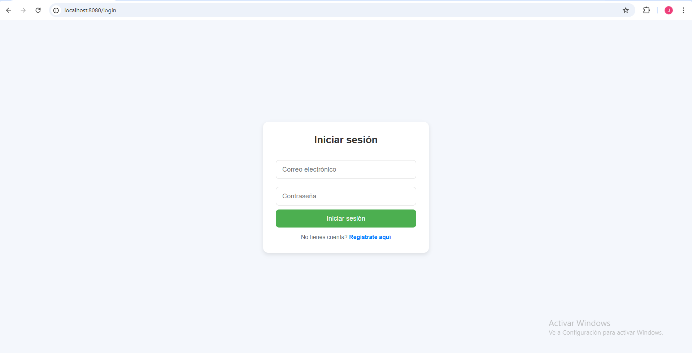
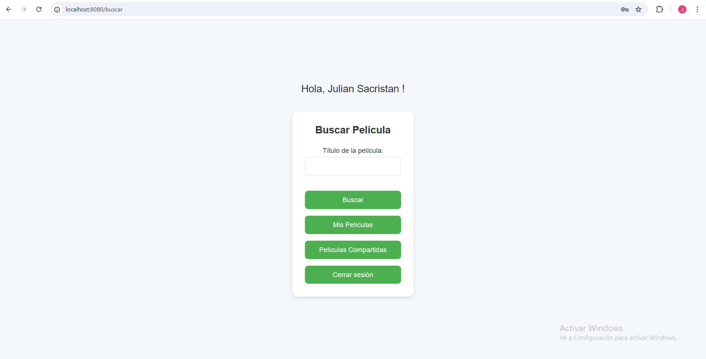
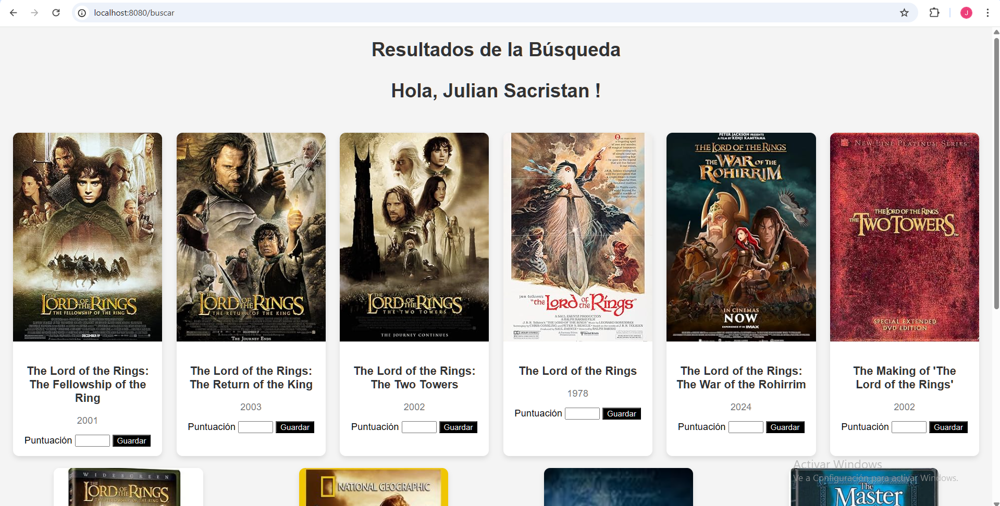
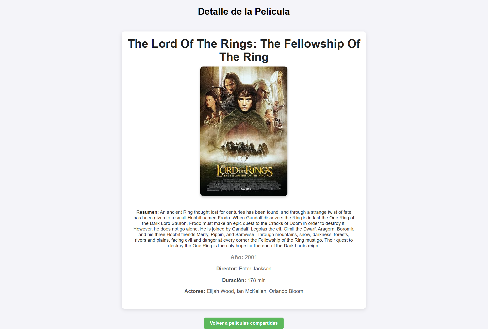
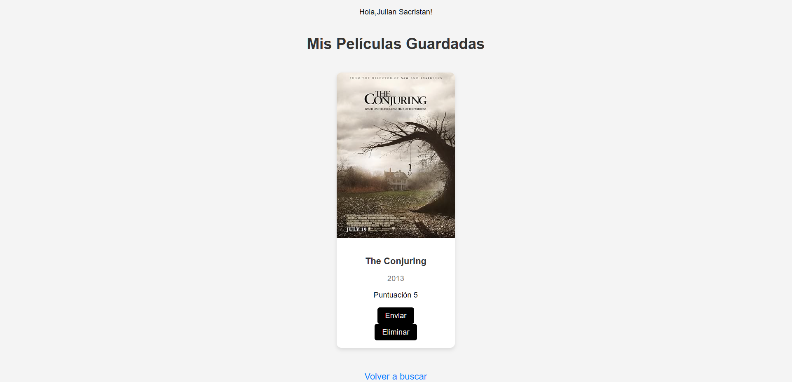

# OMDb Movie Search 

**OMDb Movie Search** es una aplicación web desarrollada con **Spring Boot + MySQL** que integra la API de **OMDb** para buscar, visualizar y guardar películas.  
Incluye **Spring Security** para autenticación y control de acceso basado en roles, persistencia en **MySQL** y una interfaz dinámica con **Thymeleaf**.  

---

## ✨ Funcionalidades  

* 🔎 **Buscar películas por título** (integración con la API de OMDb)  
* 📖 **Ver detalles completos** (sinopsis, actores, año, póster, etc.)  
* 👤 **Registro e inicio de sesión de usuarios** (Spring Security)  
* 🔒 **Autenticación y control de acceso basado en roles**  
* 💾 **Guardar películas en tu lista personal**  
* 🤝 **Compartir películas con otros usuarios registrados**  
* 🎨 **Interfaz responsive** con plantillas Thymeleaf  

---

## 🚀 Tecnologías utilizadas  

- Java 17  
- Spring Boot 3 (Web, Data JPA, Security)  
- MySQL (persistence)  
- Thymeleaf (frontend)  
- OMDb API  

---

## ⚙️ Instalación y configuración  
1. Copy `src/main/resources/application-example.properties` → `src/main/resources/application.properties`.
2. Add your OMDb API key:
   ```properties
   omdb.api.base=https://www.omdbapi.com/
   omdb.api.key=YOUR_API_KEY
   ```

---

## 🔒 Seguridad

   -Formulario de login personalizado (/login)

   -Control de acceso basado en roles de usuario

   -Contraseñas encriptadas con BCrypt

   -Autenticación por sesión

## Run
```bash
mvn spring-boot:run
```
---

## Screenshots

### Login


### Search


### Result


### Details


### Saved Movies

